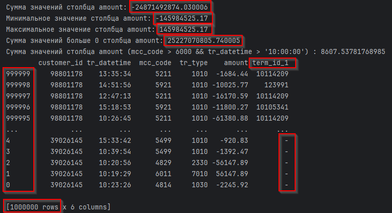
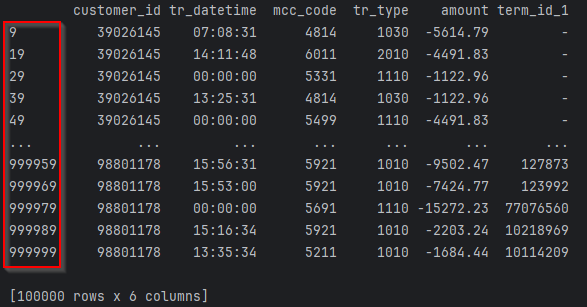
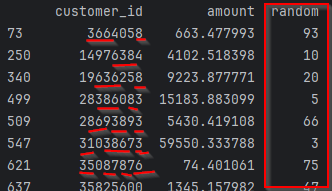
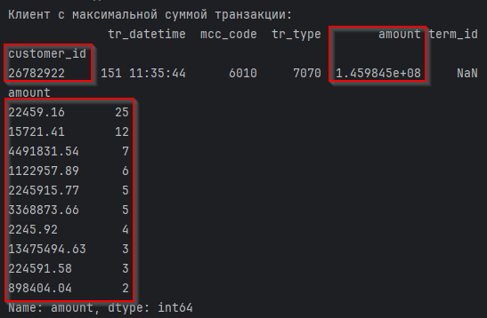
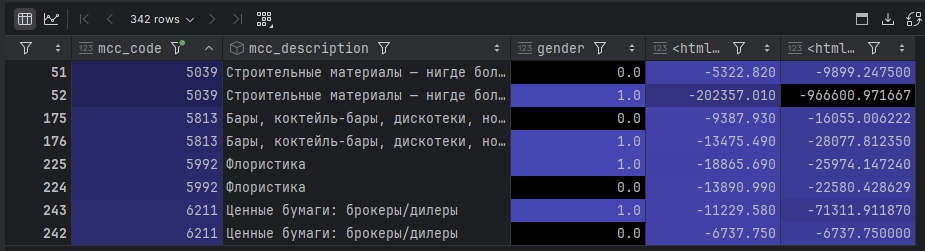

# Python

## Примечание

Используется библиотека Pandas для анализа датафреймов.  
Файл transactions.xlsx по указанной ссылке содержит в столбце amount 61 значение в виде дат!

## Задание 1

- 
- 
- 

## Задание 2

- 

Наиболее часто встречающийся модуль суммы приходов/расходов: все кроме,

5) 107407.78
6) 65019.26

## Задание 3

- 

Верные ответы:

1) gender == 0 - женщины, gender == 1 – мужчины
3) Абсолютное значение медианы с типом "Флористика" (расходов/приходов) у мужчин выше той же медианы у женщин
5) Абсолютное значение медианы женских трат (расходов/приходов) в категории "Бары, коктейль-бары, дискотеки, ночные
   клубы и таверны — места продажи алкогольных напитков" ниже мужских