# SQL

## Примечание

Выполнено в PostgreSQL последней стабильной версии с использованием Docker.
В скрпитах создания таблиц внесены небольшие изменения.

- 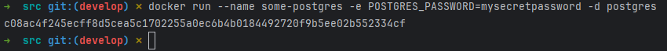

## Задание 1

- 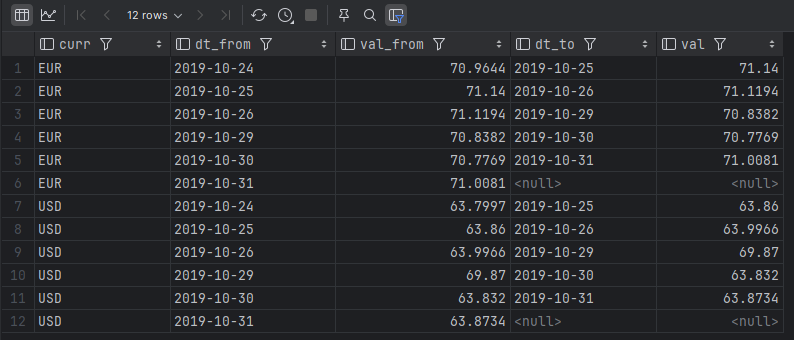

## Задание 2

- 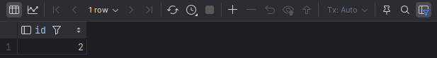

## Задание 3

- 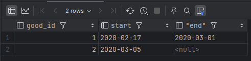

## Задание 4

- 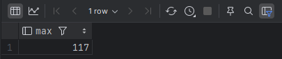

## Задание 5

### a.

- 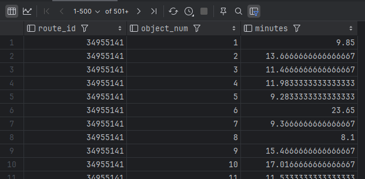

### b.

- 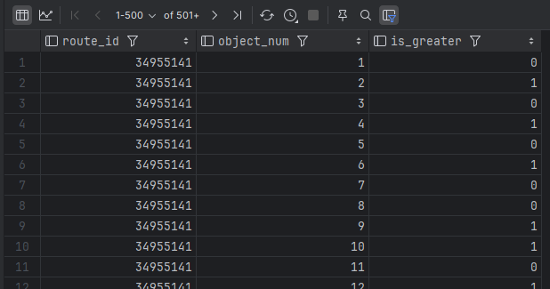

### c.

- 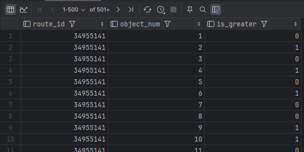

## Задание 6

### 1.

- 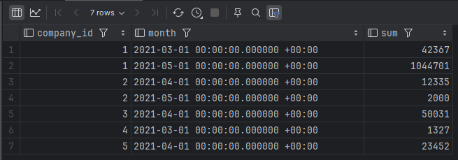

### 2.

P.s. Больше двухсот тысяч записей нет. Вывел на снимке экрана более 20 тысяч.

- 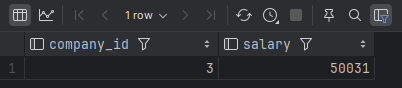

### 3.

- 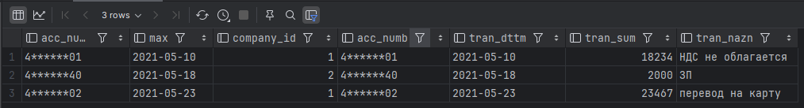

### 4.

- 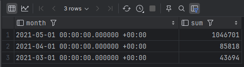

## Задание 7

Результат для текущей даты 10.09.2024.

- 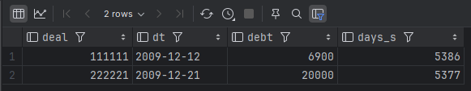

Для расчета промежуточных дат результат не корректен.

Добавлено неполное решение ex7a, но без определения даты начала текущей просрочки.

- 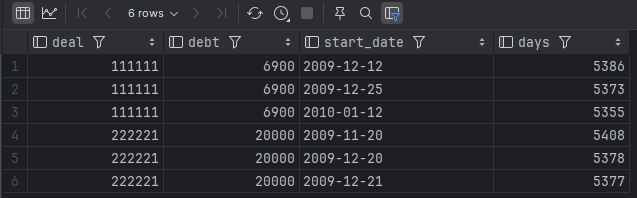

P.s. самое сложное задание для меня :)

## Задание 8

- 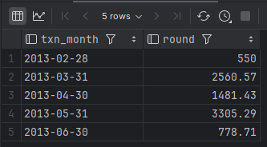

